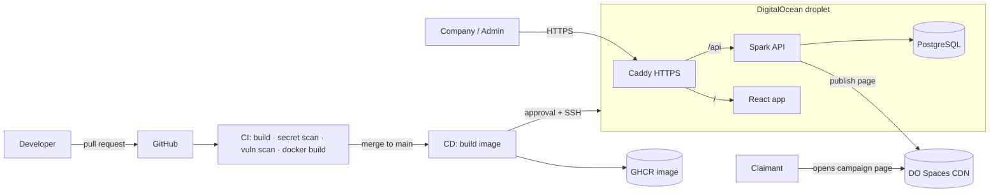

# AirDropX

[](https://github.com/Amir-Baddour/AirDropX/actions/workflows/ci.yml)
[](https://github.com/Amir-Baddour/AirDropX/actions/workflows/cd.yml)


Multi-tenant airdrop campaign platform (Web2, mocked payouts). Companies register, build an airdrop, and publish it as a public campaign page on DigitalOcean Spaces.

**Live:** https://64-23-156-149.sslip.io · API health: https://64-23-156-149.sslip.io/health

---

## What's inside

| Layer | Technology |
|---|---|
| Frontend | React 19 · TypeScript · Vite · Tailwind CSS 4 · shadcn/ui-style components · TanStack Query & Table · react-hook-form + zod · Motion |
| Backend | Java 17 · Spark Java · raw JDBC · layered architecture (Api / Core / Infra / Middleware) |
| Database | PostgreSQL 16 |
| Auth | Google OAuth → JWT, role-based access |
| Storage | DigitalOcean Spaces (S3-compatible) |
| Packaging | Docker (multi-stage build, non-root, healthcheck) |
| CI/CD | GitHub Actions → GitHub Container Registry → DigitalOcean droplet |
| Edge | Caddy reverse proxy with automatic HTTPS |

## Architecture



## CI/CD pipeline

| Stage | When | What it does |
|---|---|---|
| **CI** | every pull request and push | `mvn verify` · frontend lint, type-check, tests and build · gitleaks secret scan · Trivy dependency scan · Docker build check (API + frontend) |
| **Build images** | after CI passes on `main` | builds the API and frontend images once, tags them with the commit SHA, pushes to GHCR |
| **Deploy** | after manual approval | SSH to the server, writes secrets from GitHub, starts the new container |
| **Health check** | during deploy | waits for `/health`; **rolls back automatically** if the new version is unhealthy |
| **Smoke test** | after deploy | checks the live HTTPS URL |
| **Rollback** | manual button | redeploys any previous image tag |

Plus:
- **Dependabot** opens weekly update PRs for Maven, Docker and GitHub Actions. Each PR goes through CI first.
- **Protected `main`**: changes go through pull requests, and CI must pass before merging.

## Security

- Secrets live only in GitHub Environment secrets and are written to the server at deploy time. They are never in the repo.
- Deploy runs as a dedicated SSH-key-only `deploy` user.
- Firewall allows only 22 / 80 / 443. The database has no public port.
- Containers are memory-limited; the app container runs as a non-root user.

## Accounts and profile

Two ways to sign in, both ending in the same 24-hour JWT:

- **Google**: OAuth authorization-code flow.
- **Email and password**: register, then sign in on the login page, then the dashboard. Passwords are hashed with
  PBKDF2-HMAC-SHA256 (600,000 iterations, random salt, constant-time compare) using only the JDK. Login answers
  "Invalid email or password" for both an unknown email and a wrong password, runs one hash check either way so
  the timing does not reveal which emails exist, and is rate limited per IP and per email.

The **Profile** page (`/app/profile`) edits first name, last name, phone and address for any account, and
changes the password for email accounts. Endpoints: `POST /auth/register`, `POST /auth/login`,
`GET|PUT /user/profile`, `PUT /user/password`.

## Run locally

```bash
cd frontend && npm install && npm run dev     # http://localhost:5173, /api is proxied to :8080
```

```bash
cd backend
cp .env.example .env   # fill in your values
mvn package
java -jar target/*.jar
```

Or with Docker:
```bash
docker build -t airdropx ./backend
docker run --env-file backend/.env -p 8080:8080 airdropx
```

## Repository layout

```
frontend/         React app (dashboard + public claim pages) and its Dockerfile
backend/          Java backend (Spark + JDBC) and its Dockerfile
deploy/           server-side files: compose, Caddy, deploy + setup scripts
.github/          CI, CD, rollback workflows and Dependabot
DEPLOY.md         step-by-step server and GitHub setup
```

## My contribution

The backend architecture was designed by an experienced backend engineer. **I designed and built everything that takes it to production:**

- Containerized the backend (multi-stage Dockerfile, healthcheck, non-root user)
- Built the CI pipeline: build, secret scanning, vulnerability scanning, image build
- Built the CD pipeline: GHCR registry, approval-gated production deploy, health checks, automatic and manual rollback
- Provisioned and hardened the DigitalOcean server: firewall, deploy user, swap, Docker log rotation
- Set up HTTPS with Caddy, private networking for the database, and secret management
- Enabled Dependabot and branch protection
- Built the airdrop, claim and verification features on top of the existing architecture
- Designed and built the React frontend: company dashboard and glass-style public claim pages

## Author

**Amir Baddour**: [github.com/Amir-Baddour](https://github.com/Amir-Baddour)
