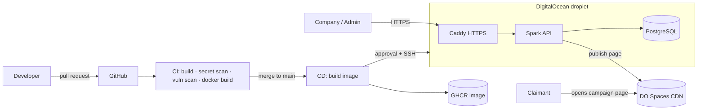

# AirDropX

[](https://github.com/Amir-Baddour/AirDropX/actions/workflows/ci.yml)
[](https://github.com/Amir-Baddour/AirDropX/actions/workflows/cd.yml)


Multi-tenant airdrop campaign platform (Web2, mocked payouts). Companies register, build an airdrop, and publish it as a public campaign page on DigitalOcean Spaces.

**Live:** https://64-23-156-149.sslip.io/health

## What's inside

| Layer | Technology |
|---|---|
| Backend | Java 17 · Spark Java · raw JDBC · layered architecture (Api / Core / Infra / Middleware) |
| Database | PostgreSQL 16 |
| Auth | Google OAuth → JWT, role-based access |
| Storage | DigitalOcean Spaces (S3-compatible) |
| Packaging | Docker (multi-stage build, healthcheck) |
| CI/CD | GitHub Actions → GitHub Container Registry → DigitalOcean droplet |
| Edge | Caddy reverse proxy with automatic HTTPS |

## Architecture



## CI/CD pipeline

| Stage | When | What it does |
|---|---|---|
| CI | every pull request and push | mvn verify · gitleaks secret scan · Trivy dependency scan · Docker build check |
| Build image | after CI passes on main | builds once, tags with the commit SHA, pushes to GHCR |
| Deploy | after manual approval | SSH to the server, writes secrets from GitHub, starts the new container |
| Health check | during deploy | waits for /health and rolls back automatically if unhealthy |
| Smoke test | after deploy | checks the live HTTPS URL |
| Rollback | manual button | redeploys any previous image tag |

Plus **Dependabot** (weekly update PRs, each tested by CI) and a **protected main branch** (pull requests + passing CI required).

## Security

- Secrets live only in GitHub Environment secrets and are written to the server at deploy time. They are never in the repo.
- Deploys run as a dedicated SSH-key-only deploy user.
- Firewall allows only 22 / 80 / 443. The database has no public port.
- Containers are memory-limited and run as non-root users.

## Run locally

```bash
cd backend
cp .env.example .env   # fill in your values
mvn package
java -jar target/*.jar
```

## Repository layout

```
backend/     Java backend (Spark + JDBC) and its Dockerfile
deploy/      server files: compose, Caddy, deploy + setup scripts
.github/     CI, CD, rollback workflows and Dependabot
DEPLOY.md    step-by-step server and GitHub setup
```

## My contribution

The backend architecture was designed by an experienced backend engineer. I designed and built everything that takes it to production:

- Containerized the backend (multi-stage Dockerfile, healthcheck)
- Built the CI pipeline: build, secret scanning, vulnerability scanning, image build
- Built the CD pipeline: GHCR registry, approval-gated production deploy, health checks, automatic and manual rollback
- Provisioned and hardened the DigitalOcean server: firewall, deploy user, swap, log rotation
- Set up HTTPS with Caddy, private database networking and secret management
- Enabled Dependabot and branch protection

## Author

**Amir Baddour**: [github.com/Amir-Baddour](https://github.com/Amir-Baddour)
